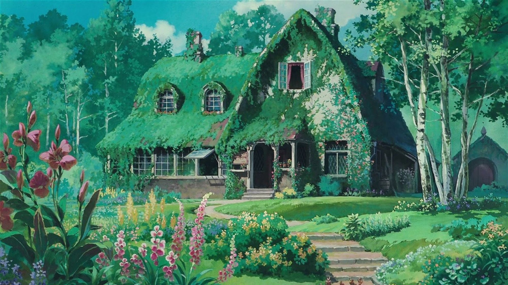

<!-- "Hero" Header -->

  
   
   
	
	 
   
   

<table  border="0">
  <tr>
    <td rowspan="3"></td>
    	<td>
		<ul>
		<li> 👋 Hi, I’m @longtianaowei</li> 
		<li> 👀 I’m interested in ...</li> 
		<li> 🌱 I’m currently learning ...</li> 
		<li> 💞️ I’m looking to collaborate on ...</li> 
		<li> 📫 How to reach me ...  
		</ul>
	</td>
  </tr>
</table>
 

  

<!-- Social -->
<!-- <table width="100%" align="center">
<tr>
<td align="center">
<a href="https://blog.shanganma.com">
<strong> </strong>
 

</a>

</td> -->

<!-- <td align="center">
<a href="https://blog.shanganma.com">
<strong>  </strong>
 

 
</a>

</td>

<td align="center">
<a href="https://blog.shanganma.com">
<strong>  </strong>
 

 
</a>

</td>

<td align="center"> -->
<!-- <a href="https://blog.shanganma.com">
 

 
</a>

</td>
</tr> -->

<!-- Social 2 -->

<!-- <tr>
<td align="center">
<a href="https://blog.shanganma.com">

 
</a>

</td>

<td align="center">
<a href="https://blog.shanganma.com">

 
</a>

</td>

<td align="center">
<a href="https://blog.shanganma.com">

 
</a>

</td>

<td align="center">
<a href="https://blog.shanganma.com">

 
</a>

</td>

</tr>
</table>

  -->

 

<!-- Guestbook -->
| Name | Date | Message |
|---|---|---|
| <a href="https://github.com/longtianaowei"> longtianaowei</a> |09/18/2024, 17:22:13 PM| 😀😀😀 README! 😀😀😀

<!-- /Guestbook -->

<!-- Footer -->

 

<!-- "margin-right: whatever;" -->
&nbsp;&nbsp;&nbsp;&nbsp;  

&nbsp;&nbsp;&nbsp;&nbsp;  

